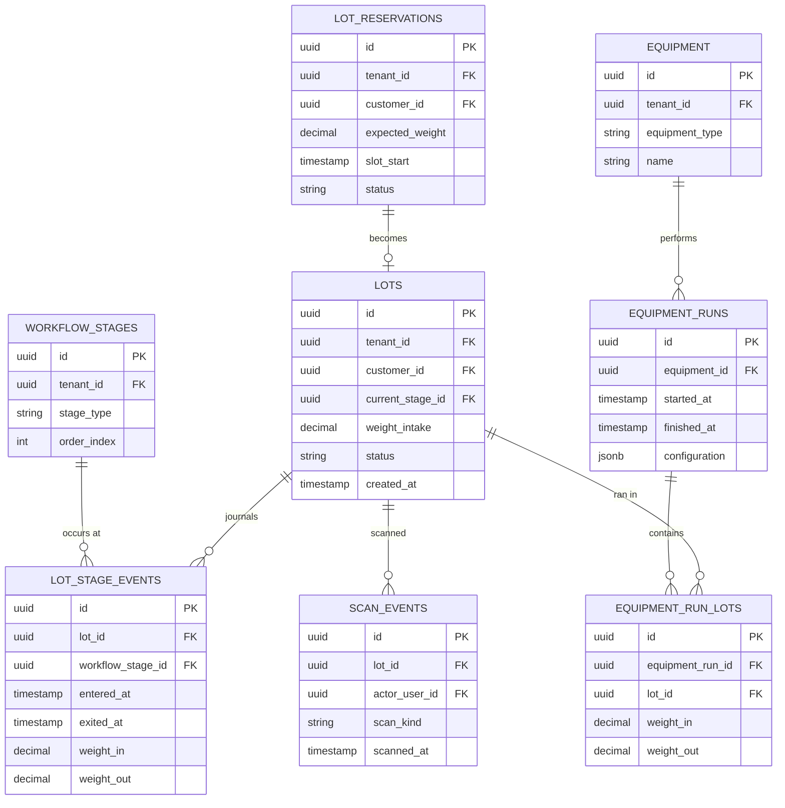
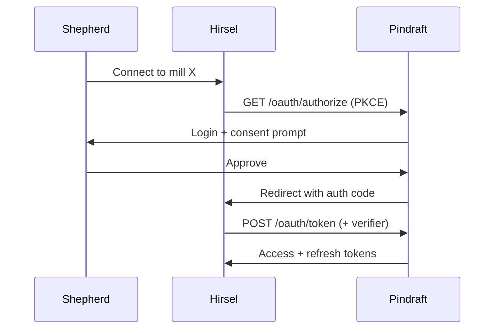

# Pindraft — Fiber Operations Platform Spec

A canonical reference for the Pindraft platform: what it is, who it serves, the architecture it runs on, and what's pinned down vs. still open. This document supersedes the earlier Sturnella Software Summary handoff for software-side decisions.

## Naming and brand architecture

The platform's name is **Pindraft**, after the worsted-spinning stage where roving is fed through a pin-drafter to align fibers in parallel before final spinning. The name is fiber-industry vocabulary, recognizable to mill operators, and clean across the SaaS namespace checks (no existing software product, no media-publication overlap, no surname collisions, no semantic mismatch with the platform's purpose). Pindraft was selected over Heddle (compromised by an active SaaS competitor using the same weaving metaphor) and Millwright (compromised by the word's modern meaning naming an unrelated industrial trade). Final formal trademark clearance — USPTO TESS in Class 9 and Class 42, ideally with a trademark attorney — remains a step before filing.

Pindraft is one of several distinct entities in the broader operation:

- **Sturnella Farm** — the agricultural operation. Land, livestock, regenerative practice. Will be the location of the first physical mill.
- **Sturnella Farm Mill** — the on-farm mill itself. The flagship Pindraft tenant; the design partner that proves the system before partner mills onboard.
- **Blackbird Wool Co.** — the consumer-facing brand. Garment tags, direct-to-consumer sales of finished textiles, yarn, sheepskins, and lanolin-based skincare. Pindraft supplies its trace data and inventory upstream.
- **Hirsel** — a separate, private flock/stock-management app. Tracks animals across an entire small-flock operation (not specifically wool/fiber). Hirsel is consumer-side for individual shepherds; Pindraft is operations and marketplace infrastructure for the regional fiber industry. The two are explicitly distinct products and integrate at a defined boundary.

Pindraft is **not** the Sturnella software platform under another label — it stands apart from Sturnella as a brand because it must serve other mills as multi-tenant infrastructure. A partner mill in Pennsylvania doesn't want to log into "Sturnella"-branded software; Pindraft is brand-neutral so any mill can host its identity on top of it.

## What Pindraft is

A regional-then-national fiber operations platform: the connective tissue of the eastern U.S. fiber industry, with national scale potential. Pindraft replaces the spreadsheets, paper intake forms, hand-written carder log sheets, and email that the U.S. small-and-mid-size fiber-mill industry currently runs on. Mill wait times of 4–6 months for yarn are largely a scheduling, batching, intake, and communication problem — Pindraft compresses that part significantly.

There is essentially no off-the-shelf software for running a custom fiber-processing mill today. The closest analogues are lumber-mill software and grain-elevator/agribusiness ERP, neither of which fits.

## Goals (priority order)

1. **Put more money in shepherds' hands.** Per-fleece quality-based pricing instead of flat-rate-by-the-pound. Aggregation of small clips into mill-ready lots that fetch better prices. Capture more of the retail dollar through pooled processing and branded sales. Progress payments at intake instead of pay-on-final-sale.
2. **Reduce mill turnaround time.** From raw fiber arriving at a mill to finished product returned to the shepherd. Replace manual scheduling/intake/admin with software, optimize batch order to minimize changeovers, give shepherds real-time status so they stop calling.
3. **Become the operations platform regional mills run on.** First Sturnella Farm Mill in Maryland, then partner mills, eventually a network.

## Audiences

Four user types with different needs:

**Shepherds.** Ship fiber to a mill, wait for finished product, get paid. Need: easy reservations before shipping, real-time status visibility, transparent pricing, payment history, fleece-by-fleece micron history over time, opt-in wool pool participation.

**Mill operators.** Run the physical equipment and the business. Need: intake control, lot tracking through every processing stage, queue and changeover optimization, batch-merge logic for wool pools, automated invoicing with weight/yield calculation, settlement and revenue-split logic, customer portal that eliminates inbound "where's my wool" calls.

**Designers, indie brands, and small fashion houses.** Source fiber, yarn, or finished cloth. Need: mill directory with capabilities, fleece marketplace, traceability with QR codes from animal to garment, mill capacity calendars, breed/micron/color specification.

**Shearers.** Schedule and route between farms. Need: a booking and route-coordination tool built around the realities of seasonal shearing routes — clusters of farms shorn in a few days, weather sensitivity, equipment logistics, mobile-first because shearers work outdoors on phones.

## Architecture

### App topology

Three frontends and one backend. The three frontends are kept separate rather than collapsed into one app with role-based routing because they have different design languages, deploy cadences, bundle profiles, and uptime needs.

- **Ops console** — desktop-first Angular with Angular Material. Dense scanner-and-keyboard UI for the mill operator's daily work. Iterates heavily during the Sturnella Farm Mill design-partner phase.
- **Customer portal** — Angular with Angular Universal for SSR. Houses the public marketplace, mill directory, and trace pages (need SEO) alongside authed shepherd dashboards and designer/brand portals (don't need SEO). Role-based home pages behind login; public routes use SSR or build-time prerendering.
- **Shearer PWA** — Angular with `@angular/pwa` added. Service worker, offline cache, push notifications, geolocation. Promotes to React Native later only if PWA limits actually bite.

### Backend

A single Spring Boot service, modular by domain. Spring Boot 4.0.6 on Java 21 (matching Hirsel's stack). Spring Modulith enforces module boundaries at the package level and documents events between modules; later extraction of any one module into its own service is possible if load profile or team ownership justifies it.

Initial domain modules:

- `identity` — users, tenants, memberships, JWT issuance, refresh tokens
- `mill-ops` — lots, batches, processing stages, equipment, scans, queues
- `marketplace` — fleece listings, mill directory, public surfaces
- `traceability` — provenance records linking animal → fleece → batch → finished product
- `pools` — wool-pool formation, economics, governance
- `billing` — invoicing, settlement, revenue splits
- `shearer` — booking, scheduling, routes
- `interop` — Hirsel integration contract, future external integrations

### Database

One Postgres, managed by Supabase but used as plain Postgres — no Supabase Auth, no Supabase client SDK, no RLS. Pindraft enforces access at the Spring layer instead.

**Three data scopes, not two.** The initial framing of tenant-scoped vs. platform-shared doesn't account for entities that belong to a specific user but aren't tied to any mill tenant — a shepherd's animals, a shearer's calendar, a Hirsel consent grant. Those get their own scope so the access rules stay simple.

- **Platform-shared** — cross-tenant readable. Users, tenants, public user profiles, mill directory entries, marketplace listings, trace records, and reference taxonomy (breeds, fiber grades, processing stage types, equipment types). Public-by-default for read; the listing or directory entry has an authoring tenant or user that controls writes.
- **Tenant-scoped** — every row carries `tenant_id`; reads and writes filtered by the user's relationship to that tenant. Memberships (staff), customer links, lots, batches, equipment, scans, invoices, payments, wool pools, pricing arrangements, queue configuration.
- **User-scoped** — every row carries `owner_user_id`. Animals, pre-shipment fleeces, Hirsel consent grants, shearer calendars and bookings, saved searches.

**Reference rules between scopes are asymmetric:**

- `tenant-scoped → platform-shared`: free. A mill's lot can reference a breed entry, a marketplace listing, a trace record.
- `user-scoped → platform-shared`: free. A shepherd's animal references the breed taxonomy.
- `tenant-scoped ↔ user-scoped`: only through `tenant_customers`. A mill references its customer link, never the user-scoped data directly; Pindraft resolves the user behind the customer record.
- `platform-shared → tenant-scoped`: indirect, through trace segments that anchor to their authoring tenant.
- `tenant A → tenant B`: forbidden. If two mills share a trace (partial-processing handoff), each writes its own segment.

**Boundary cases worth pinning explicitly:**

**Trace records** live platform-shared with public read by trace ID — anyone scanning a QR code resolves the chain. Each segment is authored by exactly one party: shepherd-user writes the farm-of-origin segment, each mill writes its own processing segment, the listing party writes the sale segment. Tenants update only their own segments. Once the trace QR is printed on a product label, segments are append-only.

**Marketplace listings** are platform-shared records. The lister is either a tenant (a mill listing finished products) or a user (a shepherd listing raw fleece). The underlying inventory stays in its native scope — mill inventory tenant-scoped, shepherd raw fleece user-scoped. Listings reference their source inventory but don't duplicate it. When something sells, the platform routes payment by the lister's identity and updates source inventory via a domain event.

**Animals and fleeces** are user-scoped to the shepherd-user, whether the data syncs from Hirsel or is entered manually on Pindraft. A fleece is user-scoped on the farm and transitions to tenant-scoped (as part of an incoming lot) when the shipment manifest is accepted by the mill. The original fleece record stays referenced from the lot for trace continuity.

**Wool pools** are administered by a single mill, so the pool record lives in that mill's tenant scope. Other mills cannot see this pool. Participating shepherds appear as `pool_participants` referencing their `tenant_customers` row at the administering mill, and see their participation through that customer relationship.

**Mill profiles** have two representations by design. The `tenants` row in platform-shared is the internal record — auth, billing, configuration. The `mill_directory_entry` is the public profile shown in the directory. Mill admins write their own directory entry; everyone reads.

**Shepherd cross-mill view.** A shepherd shipping to three mills has lots in three separate tenant scopes. A mill operator can never see across mills, but a shepherd can — *for their own lots*. The mechanism: the shepherd's frontend issues a query that joins their `tenant_customers` rows across mills, then fetches lots referencing each of those customer rows. Spring authorizes this not by tenant membership (the shepherd isn't a tenant member) but by *customer relationship*. This is the second of two `TenantAccessGuard` modes: staff access checks tenant membership; customer access checks customer relationship. Both are necessary.

**Enforcement layers in the request pipeline:**

1. **`TenantContext` extraction.** JWT carries the user's `tenant_memberships` (staff roles) and `tenant_customers` (customer relationships). On every request, Spring populates a thread-local `TenantContext` from the validated JWT. For mill-operator requests the active tenant is unambiguous; for shepherd/designer requests crossing mills, there is no single active tenant — the context carries customer relationships and queries filter via those.
2. **Repository-layer filtering.** Tenant-scoped repositories never accept raw queries without a tenant filter. The base repository checks `TenantContext` on every call and either injects the tenant filter automatically or rejects the call. This is the equivalent of RLS in application code; Postgres-level RLS could be added later as defense in depth, but primary enforcement lives at the JPA layer because access patterns are richer than RLS predicates handle cleanly.
3. **Method-level authorization.** `@PreAuthorize` on controllers gates role-based actions. Resource-level checks happen via `TenantAccessGuard`: given an entity and a `TenantContext`, return whether this user is authorized, considering both staff membership and customer relationships.

User-scoped data uses a parallel `UserOwnershipGuard` that's simpler — does `owner_user_id` match the requesting user? Platform-shared data has its own write guards: only the authoring tenant or user can edit; everyone reads.

### Auth and RBAC

Pindraft owns auth — Spring Security 6, JWT issued by the Pindraft backend, BCrypt password hashing, refresh tokens stored server-side in Postgres so revocation is immediate. Supabase Auth is **not** used; Hirsel's pattern of Supabase Auth + JWT validation at Spring is appropriate for a single-shepherd mobile app but doesn't fit the platform's multi-tenant + RBAC + multiple-user-type onboarding needs. Layering Pindraft's needs on Supabase Auth means writing most of it yourself anyway via custom claims and parallel tenant tables.

Three layers of authorization:

1. **Identity** — single users table, single login per person regardless of how many roles or tenants they touch.
2. **Membership** — what tenants does this user belong to, in what staff role, or in what customer relationship?
3. **Resource ownership** — does this lot/batch/listing belong to a tenant the user is in?

Schema (initial):

```
USERS (id, email, password_hash, name, user_type, is_platform_admin, ...)
TENANTS (id, name, kind)                           -- kind: MILL (only kind for now)
TENANT_MEMBERSHIPS (user_id, tenant_id, role)      -- staff with explicit roles
TENANT_CUSTOMERS (user_id, tenant_id, customer_kind, external_source, external_user_id)
REFRESH_TOKENS (id, user_id, expires_at, revoked)
```

Roles inside a mill tenant: `MILL_ADMIN` and `MILL_OPERATOR` for v1. Billing collapses into `MILL_ADMIN`; split out later if it earns its keep. Customer kinds: `SHEPHERD` and `DESIGNER`.

Platform admin is a flag on the user, not a tenant role — it bypasses tenant scoping.

Shearers don't fit either staff or customer relationships to a mill cleanly. They're modeled as users with `user_type=SHEARER` plus farm-booking relationships to shepherd-users. Mills don't need to know about them except via the lots that arrive carrying shearer metadata in the manifest.

JWTs carry: `user_id`, `is_platform_admin`, list of `(tenant_id, role)` for staff, list of `(tenant_id, customer_kind)` for customer relationships. Short access tokens (15 min) plus refresh-token rotation.

Enforcement: Spring Security `@PreAuthorize` on controllers for role checks; a `TenantAccessGuard` at resource level checks that any lot/batch/listing being touched belongs to a tenant the user is in. The Hirsel `FarmAccessGuard` pattern translates directly.

### Frontend rendering strategy

For the customer portal specifically, three rendering strategies map to three route types:

- **Public, content-driven, mostly stable** (mill directory, individual mill profiles, trace pages by ID) — build-time prerendering where the route set is bounded; on-demand prerendering with caching where it isn't (trace IDs accumulate forever).
- **Public, dynamic, search-driven** (marketplace search, fleece browse with filters) — full SSR via Angular Universal; Node server renders per request, Angular hydrates.
- **Authed** (shepherd dashboard, designer brand portal, settings, order management) — plain client-side SPA. Server-side guard redirects unauthed requests to login before rendering.

The ops console and shearer PWA are SPA-only; they have no SEO concerns.

### Repository structure

One monorepo, Nx for the frontend workspace, Spring Boot in a sibling directory.

```
pindraft-platform/
  frontend/                       # Nx workspace
    apps/
      ops-console/
      customer-portal/
      shearer-pwa/
    libs/
      api-client/                 # generated from backend's OpenAPI
      ui/                         # shared components, design tokens
      auth/                       # JWT handling, interceptors, guards
      domain/                     # shared types, validators
  backend/                        # Spring Boot, Gradle multi-module
    modules/
      identity/
      mill-ops/
      marketplace/
      traceability/
      pools/
      billing/
      shearer/
      interop/
  infra/
    docker-compose.yml
    flyway/
  docs/
    api-spec.yaml                 # OpenAPI, source of truth (generated)
    Pindraft_Spec.md              # this document
```

The Spring backend isn't inside the Nx workspace (Nx doesn't manage Java) but lives as a sibling in the same git repo. Two build systems sharing a history. One PR can land a Spring endpoint, its migration, the regenerated TypeScript client, and the frontend that calls it.

If a backend-only engineer joins later, splitting the repo is cheap; starting polyrepo and merging later is not.

### API contract (OpenAPI)

Code-first via springdoc-openapi. Spring controllers carry `@Operation` and `@ApiResponse` annotations; the spec is generated from the running Spring context.

Pipeline:

1. Backend build emits `api-spec.json` from springdoc-openapi.
2. Nx workspace's `api-client` lib regenerates from that spec via `openapi-generator-cli` with the `typescript-angular` generator. Output: typed Angular services + interface models.
3. Apps import from `@pindraft/api-client` — never construct `HttpClient` calls directly.
4. CI: every backend PR regenerates the client and runs the frontend's typecheck. Breaking API changes show as red TypeScript errors on the breaking PR.

Practical conventions:

- Generated code is checked into git, not treated as a build artifact. Bigger PRs in exchange for visibility on generated diffs in code review.
- An Angular `HttpInterceptor` configured against the generated services' `Configuration` handles JWT injection and refresh-token rotation on 401.

## Mill-ops domain model

The mill-ops module sits in the `mill-ops` Spring Modulith module and contains the entity model the ops console runs on. One central entity — the lot — with everything else as journal, junction, or context attached to it.

### The lot lifecycle

A reservation comes first: a shepherd books a slot before fiber ships, with expected fiber type, expected weight, requested specs, and a slot start time. The reservation persists as its own `lot_reservations` row until fiber arrives. At intake, the reservation becomes a lot — `lot_reservations.status = RECEIVED` and a new `lots` row is created with the reservation's customer, pricing arrangement, and specs snapshotted onto it.

The lot then progresses through the mill's configured workflow stages. Each stage transition opens a `lot_stage_events` row recording weight in, equipment used, operator, and timestamps. The lot may pass through equipment runs that contain other lots (a tub scoured together, a carder drum that ran several lots in a session). Eventually the lot completes — finished weight is reconciled against incoming weight, an invoice is generated, the trace segment is finalized, and the lot ships.

Lots may split (one big lot becomes two smaller lots for different end-products at the spinning stage) or merge (three shepherd contributions to a wool pool combine into one pooled lot at pool processing). Splits and merges produce new lot rows with `lot_lineage_links` recording parent/child relationships and the transition kind (SPLIT or MERGE).

### Core entities



The ERD above is the spine. `lot_lineage_links` (parent_lot_id, child_lot_id, transition_kind) is omitted from the diagram because the two-way recursion to `lots` crowds the layout; the table exists, just not shown here.

### Design hinges

**Lineage is a DAG, not a tree.** Most stages don't create new lots — a lot enters scour, leaves scour, same lot identity, lower weight. New lots are created only at split or merge events. The DAG powers the trace record: provenance walks lineage backwards from finished product to source.

**Equipment runs are the unit of batched processing, not lots.** Two flavors of batching exist in a mill, at different model levels. Wool-pool batching at the *fiber identity* level (three fleeces combined into one identity) happens once at pool formation and produces a single new lot. Floor batching (multiple lots scoured in the same tub, multiple lots carded in the same drum run) doesn't create new lots — it records that several lots passed through the same equipment together in `equipment_runs` and `equipment_run_lots`. Changeover events fall out for free: any two successive runs on the same equipment with different fiber configurations are a changeover, with cost measurable as the gap between `finished_at` of the first and `started_at` of the second.

**Current stage is denormalized on purpose.** `lots.current_stage_id` is derivable from the latest open `lot_stage_event`, but the ops console queries "show me everything currently in carding" on every dashboard load. Denormalizing avoids a window function on every read. Source of truth lives in `lot_stage_events`; `lots.current_stage_id` is a read cache, kept consistent by the stage-transition transaction that writes the event. A reconciliation job catches drift and serves as an integrity check.

**Stages are tenant-configurable.** Platform-shared reference data has `processing_stage_types` (INTAKE, SCOUR, DRY, PICK, CARD, PINDRAFT, SPIN, PLY, WIND, SHIP). Each tenant defines its own ordered `workflow_stages` referencing the types it actually performs. A mill that doesn't pindraft just doesn't include that stage. A mill with a proprietary finishing step adds it with a tenant-specific name. `lot_stage_events` references `workflow_stages`, not stage types directly, so the journal is faithful to what *this* mill does.

### Surrounding clusters

Beyond the spine, the mill-ops module includes:

**Specifications.** `lot_specifications` hangs off each lot — yarn weight (fingering / sport / DK / worsted / aran / bulky), ply count, twist direction, finishing, packaging (skein / cake / cone), color. What the operator references at spinning and finishing to decide what the lot becomes. Mostly stable from reservation through completion; editable up to a freeze point.

**Wool pools.** `wool_pools` are tenant-scoped to the administering mill, with formation criteria (breed, micron range, color, target end-product) and a status lifecycle: FORMING → CLOSED → PROCESSING → DISTRIBUTED. `wool_pool_contributions` references contributing shepherds via their `tenant_customers` row at the administering mill, with incoming and accepted weights tracked. Moving to PROCESSING creates a single new lot with lineage links from each contribution; the pool then follows the normal lot lifecycle. Distribution at the end uses contribution weights and each contributor's pricing arrangement to compute payouts.

**Fiber tests.** `fiber_tests` hang off lots, attached at a specific stage. Records test type (MICRON_DIAMETER, COMFORT_FACTOR, STAPLE_LENGTH, IWTO_47_DISTRIBUTION), instrument (FibreLux / OFDA2000 / external lab), and numeric results. Tests feed both the lot's quality history and the source animal's lifetime micron trend when traceable back through Hirsel.

**Pricing and billing.** `pricing_arrangements` are tenant-scoped templates: flat per-pound by service, tiered per-grade, or revenue-split with terms. Attached to a reservation, snapshotted onto the resulting lot at intake so the deal is frozen at the moment of agreement. `invoices` are generated from completed lots; `settlements` handle revenue-split arrangements and wool-pool distributions. Both reference back to lots and lot_stage_events for auditability.

**Scans.** `scan_events` records every QR scan, including ones that don't transition state. Stage transitions are scans with `scan_kind = STAGE_TRANSITION` and trigger the open/close of `lot_stage_event` rows plus shepherd-facing notifications. Other kinds (`NOTE`, `ISSUE`, `LOCATION_UPDATE`, `WEIGHT_CHECK`) log without changing state.

**Trace segments.** Each lot anchors into a `trace_segments` row in the platform-shared `trace_records` table. Segments are written at well-defined moments — intake (mill receives), each stage exit (with weight reconciliation), pool formation and distribution (lineage), and shipping (mill releases). Once the trace QR is printed on a finished product, segments are append-only.

### Two derivations worth pinning

**Queue and changeover optimizer.** Derivable from existing data, not its own canonical store. The optimizer reads `lots` (filtered to those waiting on a stage), `workflow_stages`, `equipment`, and historical `equipment_runs` for changeover-cost calibration. It outputs a proposed sequence the operator can accept or override. The proposal is logged for audit so the optimizer's reasoning is inspectable, but operator action is the canonical truth. This keeps the optimizer swappable — a v2 algorithm doesn't need a data migration.

**Customer-visible status.** A projection over `lot_stage_events`, not a denormalized column. Shepherds asking "where's my wool" see something like "Scoured. Drying. Carded. In spinning queue, position 7." That projection lives in a view (or a materialized view if read load demands it) over events plus a queue-position calculation. Source of truth stays in the events.

## Hirsel integration

Hirsel stays standalone — its own app, its own backend, its own database. Integration is backend-to-backend, not app-to-app. Two systems federated by per-mill shepherd consent.

The spec covers five surfaces: the OAuth consent flow, the token model, the four interop endpoints Hirsel calls into, the webhook event model Pindraft pushes back, and the Pindraft-side data model the integration introduces. The integration contract lives in its own OpenAPI spec at `docs/hirsel-interop-spec.yaml`, versioned independently from the main Pindraft API. Don't share generated client code across Hirsel and Pindraft repos — the surface area is too small and the coupling cost too high.

### Consent flow

Standard OAuth 2.0 authorization code with PKCE — Pindraft acts as the authorization server, Hirsel as the OAuth client, the shepherd as the resource owner. PKCE is mandatory even though Hirsel has a backend, because the user-facing initiation happens in the Hirsel mobile app's browser/webview; the backend stores the verifier server-side and does the final code exchange.



Each grant is scoped to a single mill — `mill:{mill_id}:interop` — and one shepherd can have grants for several mills simultaneously without those grants knowing about each other. The shepherd reaches Pindraft's login page directly, not through Hirsel; the shepherd's Pindraft credentials must never pass through Hirsel. If the shepherd doesn't yet have a Pindraft account, the login page offers signup inline.

### Token model

Access tokens are short-lived JWTs (1 hour), audience-scoped, signed by Pindraft's same JWK set as the user-facing tokens but with a distinct `aud` claim:

```
iss:   pindraft
aud:   hirsel-client-{client_id}
sub:   {shepherd_pindraft_user_id}
scope: mill:{mill_id}:interop
exp:   {now + 3600}
jti:   {token_id}
```

Refresh tokens are opaque 90-day rotating tokens stored in Postgres in `oauth_refresh_tokens` so revocation is immediate. The shepherd revoking the grant from Pindraft settings flips a `revoked` flag and Hirsel's next call returns 401. Revoking from the Hirsel side deletes Hirsel's copy of the tokens and posts to Pindraft's `/oauth/revoke` to invalidate the refresh token cleanly.

### Interop endpoints

Four Hirsel-initiated endpoints, all under `/interop/v1/`:

- `POST /shipments` — submit a shipment manifest; returns a shipment ID and a reservation ID created on Pindraft.
- `GET /shipments/{id}` — current status of a previously submitted shipment.
- `GET /lots/{id}` — current state of the lot a reservation became (after fiber arrives at the mill).
- `POST /shipments/{id}/cancel` — cancel a shipment before fiber arrives.

That's the entire Hirsel-initiated surface. Everything else is Pindraft pushing webhooks. The four OAuth endpoints — `/oauth/authorize`, `/oauth/token`, `/oauth/revoke`, `/.well-known/jwks.json` — round out the spec.

### Manifest payload

What Hirsel posts when a shepherd ships fiber:

```json
{
  "external_shipment_id": "hirsel-ship-2026-04-22-001",
  "expected_arrival_date": "2026-06-15",
  "carrier": "UPS",
  "tracking_number": "1Z999AA10123456784",
  "fleeces": [
    {
      "external_fleece_id": "hirsel-fleece-247-2026",
      "source_animal": {
        "external_animal_id": "hirsel-animal-247",
        "name": "Bramble",
        "breed_code": "ROMNEY",
        "birth_date": "2021-04-12",
        "sex": "EWE",
        "registry": null
      },
      "shorn_date": "2026-04-22",
      "shearer_name": "Tom Adams",
      "estimated_grease_weight_kg": 4.2,
      "color_code": "WHITE",
      "staple_length_mm": 110,
      "micron_history": [
        { "year": 2024, "amd_um": 32.1, "instrument": "OFDA2000" },
        { "year": 2025, "amd_um": 31.8, "instrument": "OFDA2000" }
      ],
      "notes": "Front skirt only — belly removed at shearing"
    }
  ],
  "processing_request": {
    "spec_kind": "FREE_TEXT",
    "free_text": "Worsted DK 2-ply, natural color, skein finish"
  }
}
```

Conventions worth pinning:

- **No mill ID in the payload.** The mill is encoded in the access token's scope, which means Hirsel can't accidentally cross mills with a manifest.
- **No Pindraft customer ID in the payload.** Pindraft resolves the customer from the token's `sub` claim and the mill, creating a new `tenant_customers` row with `external_source = "hirsel"` if one doesn't exist yet.
- **`external_*` fields throughout.** Hirsel uses its own IDs end-to-end; Pindraft mints internal IDs and returns them in responses, but Hirsel can always look up by its own ID via query parameter (`GET /interop/v1/shipments?external_shipment_id=...`).
- **Micron history travels with the fleece.** Even one prior year of data sharpens the mill's expectations and routes the lot to the right processing path.
- **`processing_request` is intentionally flexible.** Free-text for v1, with a structured `spec_kind = STRUCTURED` extension reserved in the schema for when the lot-specifications enum settles.

### Webhook events

Pindraft pushes events to Hirsel's registered webhook URL — one URL per OAuth client, configured at client registration, not per grant. Each event is signed with HMAC-SHA256 using a per-client signing secret (separate from the OAuth credentials) in an `X-Pindraft-Signature` header. Hirsel verifies the signature before processing. Delivery is at-least-once — Hirsel must deduplicate on `event_id`.

Event types:

- `shipment.received` — manifest accepted, reservation created
- `shipment.received_at_mill` — actual fiber arrived, reservation became a lot
- `lot.stage_transition` — lot moved to a new workflow stage
- `lot.test_recorded` — a fiber test was performed
- `lot.completed` — processing finished, invoice generated
- `lot.shipped` — finished product shipped back to shepherd
- `settlement.recorded` — payment or settlement happened (especially for wool pools)

Sample payload:

```json
{
  "event_id": "evt_01HQXYZ123",
  "event_type": "lot.stage_transition",
  "occurred_at": "2026-06-22T10:15:00Z",
  "schema_version": "1.0",
  "tenant_id": "ten_sturnella_farm_mill",
  "external_shipment_id": "hirsel-ship-2026-04-22-001",
  "subject": {
    "shipment_id": "shp_01HQ...",
    "lot_id": "lot_01HQ...",
    "stage_type": "CARD",
    "workflow_stage_name": "Carding",
    "entered_at": "2026-06-22T10:15:00Z",
    "weight_in_kg": 3.8,
    "weight_out_kg": null
  },
  "fleece_external_ids": ["hirsel-fleece-247-2026"]
}
```

`fleece_external_ids` on every event lets Hirsel update the right animal's lifetime record without holding internal Pindraft IDs across boundaries. Webhook ordering is not guaranteed — Hirsel must tolerate `lot.stage_transition CARD` arriving after `lot.completed`, which can happen if the network reorders during retry. Hirsel keys updates on `occurred_at` and ignores out-of-order events.

### Pindraft-side data model

The integration introduces four tables:

- `oauth_clients` — platform-shared. Registered API clients. For v1 there's one row (Hirsel), but the table is built for n. Fields: client_id, name, redirect_uris, webhook_url, signing_secret_hash, allowed_scopes.
- `oauth_grants` — user-scoped to the Pindraft user. Fields: client_id, scope (`mill:{id}:interop`), granted_at, revoked_at. One row per (user, mill) pair.
- `oauth_refresh_tokens` — user-scoped. Fields: grant_id, token_hash, expires_at, rotated_to (chain pointer), revoked.
- `interop_shipments` — tenant-scoped to the receiving mill. Fields: external_shipment_id (unique per client), client_id, customer_id, reservation_id, raw_manifest (jsonb), status, received_at.

The `(client_id, external_shipment_id)` unique index gives idempotency for free — Hirsel retrying a `POST /interop/v1/shipments` with the same external ID returns the existing shipment, not a duplicate. Same pattern for `external_fleece_id` on the underlying fleece records that become part of the lot.

Connection to the mill-ops domain: an accepted shipment immediately creates a `lot_reservations` row in the receiving mill's tenant scope, snapshotting the manifest's processing request onto it. The `interop_shipments` row holds the raw payload for audit; the reservation is the operational record. When fiber arrives at the mill and the operator marks intake, the reservation becomes a lot through the normal mill-ops flow.

### Versioning, errors, security

URL-versioned at `/interop/v1/`, with a `schema_version` field on every webhook payload. Backward-compatible field additions don't bump the version; breaking changes get a parallel `/v2/`. v1 stays live for at least 12 months past v2 launch. Hirsel can register a preferred webhook schema version; Pindraft falls back to the highest version Hirsel supports.

Errors follow RFC 7807 problem-details with a Pindraft-specific `code` field — `invalid_manifest`, `customer_not_resolvable`, `mill_not_accepting_intake`, `grant_revoked`, etc. Hirsel maps these to user-visible errors. The notable one is `mill_not_accepting_intake`: mills can pause accepting new shipments (capacity, seasonal closure, equipment issue) and Hirsel needs to surface that gracefully before the shepherd packs a box.

Security pins worth keeping explicit:

- Webhook URLs must be HTTPS, no exceptions.
- Signing secrets rotate quarterly via a planned `oauth_clients.signing_secret_next` slot supporting overlap.
- Access tokens carry the mill in their scope, so even a stolen token can only push to one mill — limited blast radius.
- Refresh tokens are bound to the original IP range Hirsel registered (with manual override) and rotated on every use; the previous one is invalidated on rotation.

### OpenAPI spec scope

The interop spec file at `docs/hirsel-interop-spec.yaml` contains:

- The four `/interop/v1/` endpoints (shipments, lots, cancel).
- The four OAuth endpoints (`/oauth/authorize`, `/oauth/token`, `/oauth/revoke`, `/.well-known/jwks.json`).
- The webhook payload schemas as `webhooks:` entries (OpenAPI 3.1 feature — formalizes the inverse direction).
- Shared component schemas for `Fleece`, `Animal`, `ProcessingRequest`, `Event`, `Error`.

This spec is versioned independently from the main Pindraft API. The Hirsel-side client is generated from this file separately and lives in the Hirsel repo.

## Operator workflows

The `ops-console` app centers on four screens that compose the intake-to-queue loop plus one always-open ambient surface (the scan station). The patterns here apply across all of them and the two key transactions tie the UI directly to the mill-ops domain model.

### Cross-cutting

Every ops console screen carries a header line showing the active tenant and current operator. Operators who eventually work at multiple mills need to always know which tenant they're acting in — mistakes there have real money consequences. The header also carries the active unit display (kg/lb), defaulting from tenant configuration with per-screen override available. Lot data is always stored canonically (decimal kg in Postgres) regardless of display preference.

### The intake-to-queue loop

Four screens in sequence as they appear in the operator's day:

1. **Reservations dashboard.** List of upcoming and in-progress reservations, filterable by date range, customer, and status. New-reservation action for walk-ins and phone bookings. Hirsel-sourced reservations carry a "From Hirsel" badge; manual ones look structurally identical without it.

2. **Reservation detail / new reservation form.** Captures customer, expected fiber (count, type, weights), slot timing, pricing arrangement, processing request. Hirsel-sourced reservations are read-only on manifest-derived fields up to the intake event; manually-created ones are fully editable.

3. **Intake processing.** The workhorse. Customer context card, per-fleece weight entry with animal identity from the manifest, soft warnings on weight discrepancies (e.g. −14%), optional notes and photo upload per fleece, total weight summary. The screen auto-focuses the active weight input so USB barcode scanners (which emulate keystrokes) can read a fleece bag's tag and immediately type the weight. Save creates the lot through the intake transaction (below).

4. **Post-intake confirmation.** Modal showing the new lot ID with a print-QR-labels action. Tenant config picks printer model, label template, and per-fleece vs. per-lot labeling. QRs encode a stable reference like `pindraft://t/{tenant_slug}/lot/{lot_id}`; the human-readable text is for sanity-checking. Labels can be reprinted later from lot detail.

### The scan station

Always-open ambient surface during a shift. Two modes:

- **Single lot** — scan, see lot details, confirm next action, return to ready state. Default for occasional stage transitions.
- **Batch to equipment** — preset the equipment selection (sort table, scour tub, carder drum), then each subsequent scan adds to the same active `equipment_runs` row with one tap. How a worker loading multiple lots into one piece of equipment avoids confirmation friction. Mode is sticky for the session.

After each scan the screen shows the lot's customer, fiber description, current stage and dwell time, processing spec, and proposed next action computed from the tenant's `workflow_stages` configuration. The next-action proposal is editable for cases where fiber skips a stage. Equipment selection is optional for stages tied to any free station (sort & skirt) and effectively required for stages tied to specific machinery (scour, card).

### Two key transactions

**Intake creates a lot.** A single Spring transaction at "save and create lot":

1. Creates the `lots` row with `current_stage_id` at the tenant's INTAKE workflow stage.
2. Opens the INTAKE `lot_stage_events` row (`entered_at = now`, `weight_in = per-fleece sum`).
3. Marks the reservation `RECEIVED`.
4. Snapshots the pricing arrangement onto the lot so the deal is frozen at the moment of agreement.
5. Moves the fleece records from user-scope into tenant-scoped `intake_fleeces` rows referenced from the lot.
6. Writes the intake `trace_segments` row in platform-shared scope.
7. Emits the `shipment.received_at_mill` webhook event to Hirsel for external-sourced reservations.
8. Queues a shepherd notification.

Response payload includes the lot ID and label-print configuration.

**Stage transition advances a lot.** A single Spring transaction at scan-station confirm:

1. Closes the open `lot_stage_events` row for the previous stage (`exited_at = now`, `weight_out = current entered amount`).
2. Opens a new `lot_stage_events` row for the next stage (`entered_at = now`, `weight_in = current entered amount`).
3. Updates `lots.current_stage_id` to the new workflow stage.
4. If equipment was selected, attaches to an existing open `equipment_runs` row via `equipment_run_lots`, or starts a new `equipment_runs` row if none is open for that equipment.
5. Writes a `trace_segments` row to the platform-shared trace record for the lot.
6. Emits the `lot.stage_transition` webhook event to Hirsel for external-sourced lots.
7. Queues a shepherd notification driven by the customer-visible status projection.

The transaction is short (hundreds of milliseconds) so the scan station returns to ready state immediately, supporting continuous scanning of multiple bags in a row.

### Queue dashboard

Per-stage view of everything currently at that stage:

- **Top:** capacity summary cards — lots in queue, active runs vs. total stations, total weight. Capacity visible at a glance.
- **Middle:** active runs section. Each open `equipment_runs` row shows equipment, start time, operator, and contained lots. Visually distinct from waiting lots (success-colored badge) because actions differ — active runs accept additions or finalization; waiting lots are candidates for new runs.
- **Bottom:** waiting lots table with lot, customer and fiber, weight, dwell time. Sorted by dwell time (longest first) with optional reorder via the queue optimizer's non-binding suggestion. Just-arrived lots get a read-time info-color highlight for the first minute or two.

The "Optimizer suggestion" action surfaces the queue-and-changeover optimizer's proposed sequencing — derived from `lots` filtered by current stage, `workflow_stages`, `equipment`, and historical `equipment_runs` changeover-cost data. Proposals are logged for audit but operator action stays canonical.

### Walk-in path

Intake of fiber that arrives without a reservation needs its own variant of the intake processing screen — same structural pattern but starting from an empty form, with customer chosen from a searchable picker, fleeces and weights entered manually, processing request captured directly. No "From Hirsel" badge, no expected-weight column. Identified as an open item for v1.

## Onboarding

Every mill walks through onboarding before its operators can do anything useful. The MILL_ADMIN's job is to translate the platform's universal model (platform-shared `processing_stage_types`, the generic `tenants` row, the empty equipment list) into *this* mill's specific configuration. Until this surface exists, every new mill requires manual database setup, which contradicts the mill-agnostic-by-configuration principle. Onboarding is the gating wedge for partner-mill scalability.

The screen pattern is hub-and-spoke: a setup checklist hub, detail screens for each configuration area, and a "go live" gate that opens once required items are green.

### Configuration areas

Four required, three optional.

**Required** — `tenants.status` stays at `SETUP` until all four are green:

- **Mill profile.** Name, address, contact, default unit, time zone, optional logo. A standard form. Directory-listing toggle lives here but is a separate decision from the profile itself — a mill can be fully configured but unlisted.
- **Workflow stages.** Which stages from the platform-shared `processing_stage_types`, in what order, with mill-specific display names. The key configuration screen — covered in detail below.
- **Equipment inventory.** Grouped by stage. Each piece has a name, equipment type (from a platform-shared `equipment_types` taxonomy: `SORT_TABLE`, `SCOUR_TUB`, `PICKER`, `CARDER`, `PIN_DRAFTER`, `SPINNING_FRAME`, `PLYER`, `WINDER`, etc.), and optional capacity hints (max weight per run, typical run duration). Capacity hints feed the queue optimizer's changeover model later. The screen warns when a configured stage has zero equipment; stages that don't need equipment (sort & skirt is often hand work at any free table) can be marked "no equipment required" instead.
- **Pricing templates.** The most variable and complex of the four. Captures whatever pricing structures a mill offers — flat per-pound per service, tiered per-grade with breakpoints, hybrid (flat fee plus per-pound), revenue split with mill / brand percentages and terms. Each template has a name the operator picks from when creating a reservation; the underlying structure gets snapshotted onto lots at intake so changing a template later doesn't affect in-flight work.

**Optional** — admins can complete or defer:

- **Operator invitations.** Email invite, account claim, role assignment. A solo admin who is also the only operator skips this.
- **Directory listing.** Off by default. Toggling on later requires no other changes.
- **Label printer.** Defaults to the OS print dialog. Configurable to specific models (Brother QL-820, Zebra ZD420, etc.) with selectable label templates.

### The hub

The hub query is a single Postgres view over four tenant-scoped tables — `tenants`, `workflow_stages`, `equipment`, `pricing_arrangements` — plus the `tenants.status` column. The view returns a fixed-shape row per setup category with a completion status, a short summary string, and a "what's missing" string when applicable. New required categories added later extend the view; the hub UI renders whatever the view returns rather than hardcoding the four current categories.

Three status states, not two: `DONE`, `PARTIAL` (with specifics — "1 of 6 stages have equipment"), and `NOT_STARTED`. The hub avoids generic "incomplete" labels because they're information-free. Required cards are full-width with continue actions; optional items are compact tiles. The visual difference does work — a new admin's eye lands on the required column first.

The go-live gate is at the bottom of the hub by design, so admins scroll past every required item on their way to clicking it. Clicking it flips `tenants.status` from `SETUP` to `LIVE`, opens the reservation booking endpoint (returns `423 Locked` before this), and surfaces the operator screens in navigation. The optional items remain accessible from the same hub after going live — the natural place for ongoing admin work.

### Workflow stages screen

The screen where the mill-agnostic-by-configuration principle has to deliver. Two columns, one canonical and one editable:

- **Type column** — the canonical `processing_stage_type` (`INTAKE`, `SORT`, `SCOUR`, `DRY`, `PICK`, `CARD`, `PINDRAFT`, `SPIN`, `PLY`, `WIND`, `SHIP`). Platform-shared reference values that never change per tenant. Powers reporting, cross-mill comparisons, queue optimization, Hirsel webhook payloads, and the queue optimizer's changeover model.
- **Display name column** — what the mill's team and customers see. Fully editable per tenant. A mill that calls their wash step "wash" instead of "scour" types it in the display name; the underlying type stays `SCOUR` so code and integrations keep working.

This split is the whole mill-agnostic principle in one screen.

A horizontal flow preview at the top renders the configured stages as `Intake → Sort & skirt → Scour → ...`, updating live as the admin reorders or edits. This is what the operator sees on every lot.

`INTAKE` and `SHIP` are required and can't be removed — every lot has to enter somewhere and leave somewhere. The other stage types are all optional.

**Custom stages.** The "add stage" modal shows all `processing_stage_types` not currently in the workflow, plus an "Other / custom" option that asks for a name and description, marks the stage as `tenant_custom = true`, and stores it as a tenant-private stage type that doesn't roll up into cross-mill reporting. Custom stages cover proprietary finishing steps, regional preparation techniques, or anything the platform's universal taxonomy doesn't anticipate. Custom stages that show up across enough mills can eventually be promoted to platform-shared stage types via admin review.

**Editing an in-use workflow.** Mills evolve. The rules:

- A stage can't be removed if any lot is currently in it.
- Adding a new stage is always fine.
- Reordering is fine for lots that haven't yet reached the reordered stages; for those that have, the system warns and lets the admin choose whether to apply the new order to in-flight lots (rare but sometimes necessary) or only to new lots (the default).

### Tenant status transitions

`tenants.status`:

- `SETUP` — initial state. Reservation booking endpoint returns `423 Locked`. Marketplace and directory don't show the tenant. Operator screens are hidden from navigation. Onboarding hub is the only available surface.
- `LIVE` — operating normally. All surfaces enabled.
- `PAUSED` — admin temporarily not accepting new intake (capacity, seasonal closure, equipment issue). Blocks new reservations and the `mill_not_accepting_intake` interop error fires; in-flight lots continue normally. Directory listing shows a "currently paused" badge if listed.

Transitions: `SETUP → LIVE` (the "go live" click), `LIVE ↔ PAUSED` (toggleable from settings).

### Open onboarding items

Specific sub-items still on the board:

- The full pricing-template screen design (most variable, most complex; deserves its own exploration).
- The add-stage modal design (custom stage flow, promotion-to-shared review process).
- The `equipment_types` taxonomy settling — likely starts with the eight types listed above and grows as mills onboard with proprietary equipment.
- The operator invitation flow (email invite, account claim, role assignment).
- Stage-removal and reordering edge cases (UX for "this would break LOT-5821 currently in CARD" warnings).

## Core feature set

Grouped by audience surface, roughly in build order. The first surface to ship is the mill operator's intake and lot tracking — that's the wedge that gets Sturnella Farm Mill onto Pindraft.

### Mill operations (operator-facing, in `ops-console`)

- Online intake and reservation. Shepherds book a slot before shipping; the mill only accepts fiber when it can start it. Eliminates the limbo where fleece sits in a barn at the mill for months waiting its turn.
- Barcoded lot tracking with QR codes scanned at each stage (intake, scour, dry, pick, separate, card, pindraft, spin, ply, wind, ship). State changes drive shepherd-facing notifications.
- Queue and batch optimizer over the queue of incoming lots, sequencing to minimize changeovers and equipment cleanings.
- Batch-merge / wool-pool logic: combine three small clips of similar fiber into one efficient mill-ready lot.
- Yield and weight reconciliation per lot.
- Automated invoicing and settlement: pay-by-weight, pay-by-grade, or revenue-split when finished product sells under a brand.
- At-line micron testing integration: FibreLux at the low end (~$2,500, mean fiber diameter only) or OFDA2000 at the high end (~$75K, full distribution + comfort factor + staple profile). Results attach to the lot.

### Shepherd surface (in `customer-portal`)

- Reservation booking with deposits.
- Real-time lot status: "Scoured. Drying. Carded. In spinning queue, position 7."
- Per-fleece micron history over time, tied back to source animals where possible (via Hirsel integration).
- Pricing transparency.
- Payment history and progress payments.
- Wool pool participation: opt-in, see what pool a fleece went into, see the pool's combined micron and comfort factor.

### Designer / brand surface (in `customer-portal`)

- Mill directory: capabilities, capacity, lead times, specialties (fine wool, bast fiber, dual-coat, etc.).
- Fleece marketplace: search by breed, micron, comfort factor, color, region, certification.
- Traceability layer: QR-scannable provenance from animal to finished garment. Powers Blackbird Wool Co. consumer trace stories upstream.
- Mill capacity calendar and booking.
- Custom processing specs: breed, micron target, end product, color, finish.

### Wool pool / aggregation (cross-cutting)

- Geographic and breed-based pool formation, software-proposed based on micron, breed, staple length, and proximity.
- Pool economics: expected yield, expected price, distribution math by incoming weight × quality.
- Pool governance: who decides what gets pooled, what end product, what mill.

### Shearer scheduling (in `shearer-pwa`)

- Shearer profiles, calendars, regions covered.
- Farm booking with crew size and pen count.
- Route optimization across a cluster of farms in the same week.
- Mobile-first because shearers work outdoors on phones.

### Marketplace surfaces (in `customer-portal`)

- Fleece sales (raw and processed).
- Seedstock sales (breeding animals, with EBV data when present).
- Mill-finished products (yarn, roving, batts, felt) for direct-to-consumer or wholesale. Sturnella Farm Mill output destined for Blackbird Wool Co. flows through here.

### Operations software for partner mills

- The same ops console UI, white-labelled or co-branded for partner mills outside Sturnella Farm.
- Multi-tenant architecture from day one, even though the first deployment is a single mill.

## Non-goals

- Not a flock-management application — that's Hirsel.
- Not a generic farm-management ERP.
- Not a Blackbird Wool Co. DTC website. The consumer brand has its own surfaces; Pindraft supplies the trace data and inventory upstream.
- Not telecom optical-fiber network management. (Search-engine namespace overlap is unfortunate but unavoidable; no overlap in product or brand.)

## Design principles

- **Mill operator first.** If the ops console doesn't make a busy mill day easier, nothing else matters. Adoption depends on whether a mill replaces its spreadsheets with Pindraft.
- **Mill-agnostic by configuration.** No screen, query, or business rule hardcodes anything to a specific tenant. Every dropdown, taxonomy, default, and workflow step reads from tenant configuration backed by platform-shared reference data. A partner mill onboarding sees structurally identical screens to Sturnella Farm Mill; differences live in their configuration, not code branches.
- **Real numbers, real money.** Weights, yields, dollar amounts, revenue splits — all of it auditable and exactly correct. This is people's livelihood.
- **Traceability as a first-class data-model concern**, not an afterthought. Every transformation (raw → scoured → carded → spun) records provenance. This is also the data layer that powers Blackbird Wool Co. trace stories on consumer-facing products.
- **Interop with Hirsel.** A Hirsel user shipping fiber to a Pindraft mill should not re-enter data Pindraft already has access to via the consent grant.
- **Don't over-build for "national" before proving "regional."** Sturnella Farm Mill is the design partner. Get that right before generalizing.

## Open items / next moves

What's still up next, roughly in priority order:

1. **Pricing-template configuration screen.** The most complex of the onboarding surfaces — pay-by-weight, tiered per-grade, hybrid, revenue-split. Pricing math lives here and deserves its own deeper design pass.
2. **Walk-in intake path.** The variant of the intake processing screen for fiber that arrives without a reservation — customer search picker, manual fleece entry, processing request capture, no Hirsel badge.
3. **Reservations dashboard list view.** The screen *before* the intake processing flow — list, filters, create-new action. The operator's daily landing surface.
4. **Operator invitation flow.** Email invite, account claim, role assignment. The optional onboarding step that becomes essential as soon as a mill has more than one person.
5. **Equipment-type taxonomy settling.** The platform-shared list of equipment types that the inventory screen reads from — starts narrow (SORT_TABLE, SCOUR_TUB, PICKER, CARDER, PIN_DRAFTER, SPINNING_FRAME, PLYER, WINDER) and grows as mills onboard.
6. **Write the Hirsel interop OpenAPI YAML.** Translate the spec above into the actual `docs/hirsel-interop-spec.yaml` file. Mechanical work once the design is settled.
7. **Naming verification.** Real WHOIS check on `pindraft.com` and common variants; USPTO TESS search in Class 9 (software) and Class 42 (SaaS), ideally with a trademark attorney before filing. Open-web search cleared the namespace; formal clearance is the next step.

## Tech stack summary

- **Backend:** Spring Boot 4.0.6, Java 21, Spring Modulith, JPA/Hibernate, Flyway, Spring Security 6
- **Database:** Postgres (Supabase managed, used as plain Postgres)
- **API contract:** OpenAPI via springdoc-openapi, regenerated to TypeScript-Angular client on every backend change
- **Frontend framework:** Angular (current major), Angular Material (ops console), Angular Universal (customer portal SSR), `@angular/pwa` (shearer)
- **Frontend workspace:** Nx monorepo with apps + libs
- **Local dev:** Docker Compose (Postgres + backend), `nx serve` per frontend app
- **Deployment:** TBD — likely containerized backend on Cloud Run / Render / similar; frontends on a CDN with a Node server alongside for the SSR'd customer portal
